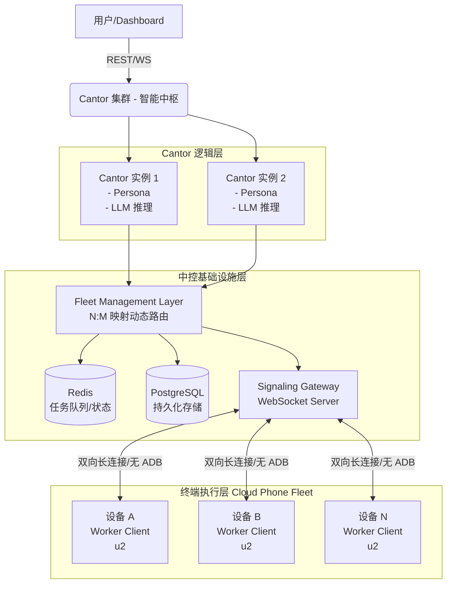

# Cantor - 系统架构设计文档 (ARCHITECTURE)

## 1. 架构概览与拓扑
Cantor 采用 **Cantor 1:N 拓扑架构**，彻底贯彻"脑手分离"设计。

## 2. 核心组件设计

### 2.1 Cantor 实例 (Cantor Instance)
系统的最小独立思考单元。
- **职责**：意图解析、任务拆解、快慢引擎调度。
- **状态维护**：维护关联的 `FleetMapping`，监控所属群组设备的健康度。
- **决策路由树**：
  1. 接收业务任务。
  2. 匹配本地 `Script Registry`（快引擎脚本）。
  3. 若命中，下发指令与 `Script ID` 给设备。
  4. 若未命中或设备上报执行失败，挂起子任务。
  5. 走**慢引擎**，调用 VLM (Vision-Language Model) 请求截图分析，下发自愈 UI 动作（如绝对坐标点击）。
  6. 慢引擎成功后，抛出事件给 `Script Forge`。

### 2.2 信令网关 (Signaling Gateway)
替代传统直连 ADB 的通信桥梁。
- **协议**：基于 WebSocket 的 JSON-RPC 2.0 双向通信。
- **职责**：
  - 管理成千上万云手机设备的长连接。
  - 维护心跳（Heartbeat）和断线重连（指数退避机制）。
  - 实现 Cantor 下发指令到具体设备的精确路由。
- **容错**：采用异步 Future 等待响应，支持 `timeout` 与自动重发。

### 2.3 Script Forge (自动化编译器)
"AI 驱动的代码生成器"，负责将慢引擎的操作提炼为快引擎脚本。
- **触发机制**：监听慢引擎的成功执行事件。
- **流程**：提取操作上下文（截图序列、坐标、UI XML树） -> 调用代码大模型（如 Qwen-Coder） -> 生成 Python DSL 快引擎脚本 -> 沙箱环境干跑（Sandbox Validation） -> 验证通过后入库。

### 2.4 基建接入层 (Infrastructure Integrations)
- **职责**：作为系统的原生内部模块（Native Modules），直接对接底层基建，去除额外的 MCP 协议开销，保障低延迟与高性能。
- **IaaS Provider 模块**：直接封装各云服务商的 REST API，负责设备群组实例的创建、销毁与状态查询。
- **RTC Controller 模块**：直接对接云手机的 RTC SDK，用于拉取低延迟音视频流（供 VLM 抽帧）及下发毫秒级的底层触控信令。

## 3. 数据模型设计 (PostgreSQL)

- **CantorInstance**: `id`, `name`, `persona_prompt`, `model_config`, `status`
- **Device**: `id`, `provider`, `provider_instance_id`, `signaling_connected`, `status`
- **DeviceFleetMapping** (多对多关联): `cantor_id`, `device_id`, `status`
- **Task**: `task_id`, `cantor_id`, `device_id`, `instruction`, `engine_type` (fast/slow/script), `status`
- **Script**: `id`, `name`, `content_dsl`, `version`, `status` (draft/verified/published)

## 4. 队列与缓存设计 (Redis)

- **任务队列**：`cantor:{cantor_id}:queue` (List)，Cantor 发布任务，对应集群的设备 Worker 通过抢占/轮询获取。
- **设备状态流**：`device:status:{device_id}` (Hash)，实时反映设备的在线、空闲、忙碌状态。
- **Pub/Sub 总线**：用于内部微服务解耦，如 `topic:slow_engine_success` 触发 Script Forge。

## 5. 部署拓扑 (Go + Python 混编微服务)
- **基建层 (Go)**：`Signaling Gateway` 和 `Fleet Management` 由 Golang 编写，利用 Goroutine 的高并发优势死死握住十万级云手机的 WebSocket 长连接，提供极高的稳定性与极低的内存占用。
- **逻辑层 (Python)**：`Cantor 实例集群` 和 `Script Forge` 由 Python 编写。专心做 prompt 编排、VLM 视觉解析、大模型调用和动态生成/执行快引擎 DSL 脚本。
- **微服务通信**：Go 节点与 Python 节点之间通过 Redis 队列（如 `cantor:{id}:queue`）与 gRPC 协议进行高性能通信。
- **中间件**：云原生 PostgreSQL (RDS) 和 Redis Cluster。
- **客户端**：将 Python/Go 编写的 Worker Client 打包到云手机 IaaS 平台的标准基础镜像（Golden Image）中，随实例启动自动连回 Gateway。