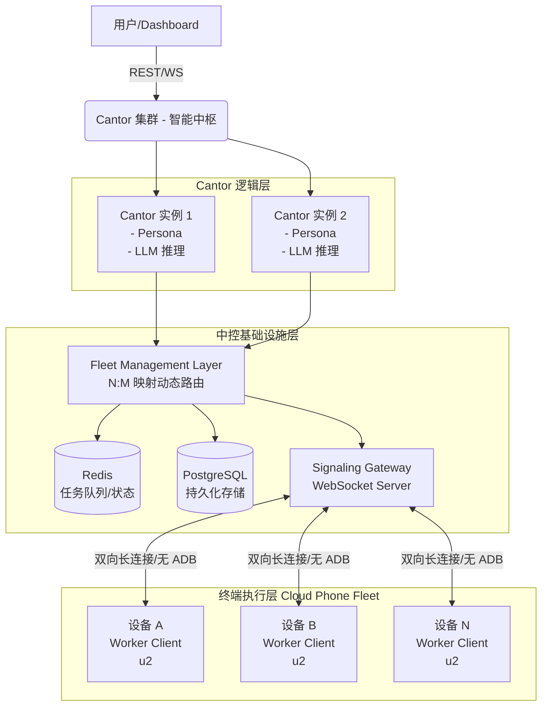
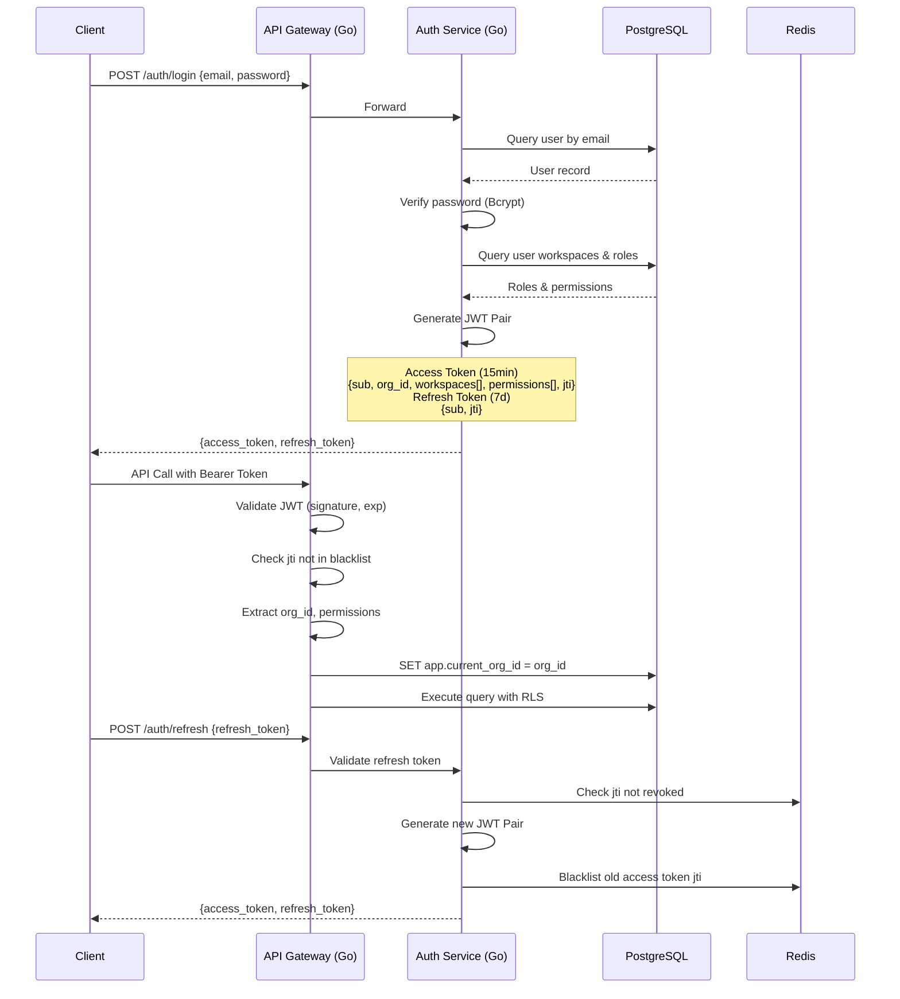
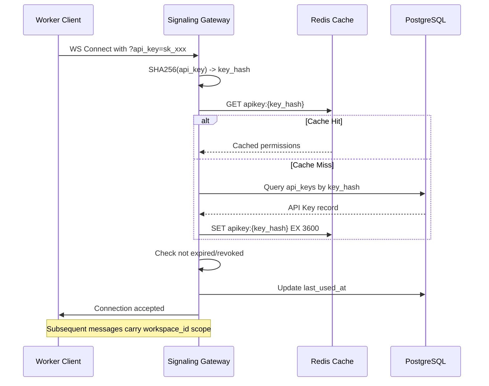
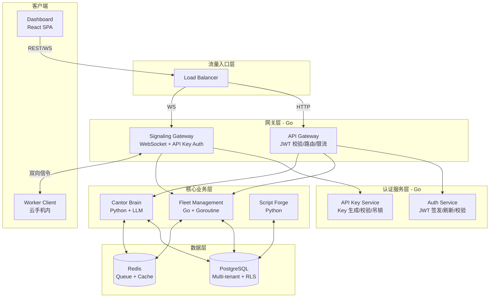

# Cantor - 系统架构设计文档 (ARCHITECTURE)

## 1. 架构概览与拓扑
Cantor 采用 **Cantor 1:N 拓扑架构**，彻底贯彻"脑手分离"设计。



## 2. 核心组件设计

### 2.1 Cantor 实例 (Cantor Instance)
系统的最小独立思考单元。
- **职责**：意图解析、任务拆解、快慢引擎调度。
- **状态维护**：维护关联的 `FleetMapping`，监控所属群组设备的健康度。
- **决策路由树**：
  1. 接收业务任务。
  2. 匹配本地 `Script Registry`（快引擎脚本）。
  3. 若命中，下发指令与 `Script ID` 给设备。
  4. 若未命中或设备上报执行失败，挂起子任务。
  5. 走**慢引擎**，调用 VLM (Vision-Language Model) 请求截图分析，下发自愈 UI 动作（如绝对坐标点击）。
  6. 慢引擎成功后，抛出事件给 `Script Forge`。

### 2.2 信令网关 (Signaling Gateway)
替代传统直连 ADB 的通信桥梁。
- **协议**：基于 WebSocket 的 JSON-RPC 2.0 双向通信。
- **职责**：
  - 管理成千上万云手机设备的长连接。
  - 维护心跳（Heartbeat）和断线重连（指数退避机制）。
  - 实现 Cantor 下发指令到具体设备的精确路由。
- **容错**：采用异步 Future 等待响应，支持 `timeout` 与自动重发。

### 2.3 Script Forge (自动化编译器)
"AI 驱动的代码生成器"，负责将慢引擎的操作提炼为快引擎脚本。
- **触发机制**：监听慢引擎的成功执行事件。
- **流程**：提取操作上下文（截图序列、坐标、UI XML树） -> 调用代码大模型（如 Qwen-Coder） -> 生成 Python DSL 快引擎脚本 -> 沙箱环境干跑（Sandbox Validation） -> 验证通过后入库。

### 2.4 基建接入层 (Infrastructure Integrations)
- **职责**：作为系统的原生内部模块（Native Modules），直接对接底层基建，去除额外的 MCP 协议开销，保障低延迟与高性能。
- **IaaS Provider 模块**：直接封装各云服务商的 REST API，负责设备群组实例的创建、销毁与状态查询。
- **RTC Controller 模块**：直接对接云手机的 RTC SDK，用于拉取低延迟音视频流（供 VLM 抽帧）及下发毫秒级的底层触控信令。

## 3. 数据模型设计 (PostgreSQL)

### 3.1 多租户核心实体

```sql
-- 组织/租户表
CREATE TABLE organizations (
    id UUID PRIMARY KEY DEFAULT gen_random_uuid(),
    name VARCHAR(255) NOT NULL,
    slug VARCHAR(100) UNIQUE NOT NULL, -- URL 标识
    tier VARCHAR(20) DEFAULT 'b2b', -- b2b/b2c
    status VARCHAR(20) DEFAULT 'active',
    quotas JSONB DEFAULT '{}', -- 资源配额 {max_workspaces: 10, max_devices: 500}
    settings JSONB DEFAULT '{}',
    created_at TIMESTAMPTZ DEFAULT NOW(),
    updated_at TIMESTAMPTZ DEFAULT NOW()
);

-- 工作空间表
CREATE TABLE workspaces (
    id UUID PRIMARY KEY DEFAULT gen_random_uuid(),
    org_id UUID NOT NULL REFERENCES organizations(id) ON DELETE CASCADE,
    name VARCHAR(255) NOT NULL,
    description TEXT,
    quotas JSONB DEFAULT '{}',
    settings JSONB DEFAULT '{}',
    created_at TIMESTAMPTZ DEFAULT NOW(),
    updated_at TIMESTAMPTZ DEFAULT NOW()
);

-- 用户表
CREATE TABLE users (
    id UUID PRIMARY KEY DEFAULT gen_random_uuid(),
    org_id UUID NOT NULL REFERENCES organizations(id) ON DELETE CASCADE,
    email VARCHAR(255) UNIQUE NOT NULL,
    phone VARCHAR(20),
    password_hash VARCHAR(255), -- Bcrypt
    name VARCHAR(100),
    avatar_url TEXT,
    status VARCHAR(20) DEFAULT 'active',
    mfa_enabled BOOLEAN DEFAULT FALSE,
    mfa_secret VARCHAR(255),
    last_login_at TIMESTAMPTZ,
    created_at TIMESTAMPTZ DEFAULT NOW(),
    updated_at TIMESTAMPTZ DEFAULT NOW()
);

-- 角色定义表（支持自定义角色）
CREATE TABLE roles (
    id UUID PRIMARY KEY DEFAULT gen_random_uuid(),
    org_id UUID REFERENCES organizations(id) ON DELETE CASCADE, -- NULL 表示系统预设角色
    name VARCHAR(100) NOT NULL,
    description TEXT,
    permissions TEXT[], -- ['cantor:*', 'device:read']
    is_system BOOLEAN DEFAULT FALSE, -- 系统预设不可删除
    created_at TIMESTAMPTZ DEFAULT NOW()
);

-- 用户-角色-工作空间关联（数据范围权限）
CREATE TABLE user_workspace_roles (
    id UUID PRIMARY KEY DEFAULT gen_random_uuid(),
    user_id UUID NOT NULL REFERENCES users(id) ON DELETE CASCADE,
    workspace_id UUID NOT NULL REFERENCES workspaces(id) ON DELETE CASCADE,
    role_id UUID NOT NULL REFERENCES roles(id) ON DELETE CASCADE,
    granted_by UUID REFERENCES users(id),
    created_at TIMESTAMPTZ DEFAULT NOW(),
    UNIQUE(user_id, workspace_id, role_id)
);

-- API Key 表（用于设备端和自动化脚本认证）
CREATE TABLE api_keys (
    id UUID PRIMARY KEY DEFAULT gen_random_uuid(),
    org_id UUID NOT NULL REFERENCES organizations(id) ON DELETE CASCADE,
    workspace_id UUID REFERENCES workspaces(id) ON DELETE CASCADE, -- NULL 表示组织级 Key
    name VARCHAR(100) NOT NULL,
    key_hash VARCHAR(255) UNIQUE NOT NULL, -- SHA256(key)
    key_preview VARCHAR(10), -- 前几位用于展示
    permissions TEXT[], -- 限定权限子集
    expires_at TIMESTAMPTZ,
    last_used_at TIMESTAMPTZ,
    created_by UUID REFERENCES users(id),
    created_at TIMESTAMPTZ DEFAULT NOW(),
    revoked_at TIMESTAMPTZ
);

-- 审计日志表
CREATE TABLE audit_logs (
    id UUID PRIMARY KEY DEFAULT gen_random_uuid(),
    org_id UUID NOT NULL REFERENCES organizations(id) ON DELETE CASCADE,
    user_id UUID REFERENCES users(id),
    action VARCHAR(100) NOT NULL, -- 'task.execute', 'api_key.create'
    resource_type VARCHAR(50), -- 'task', 'device', 'api_key'
    resource_id UUID,
    ip_address INET,
    user_agent TEXT,
    payload JSONB,
    created_at TIMESTAMPTZ DEFAULT NOW()
) PARTITION BY RANGE (created_at);
```

### 3.2 业务实体（带租户隔离）

```sql
-- 所有业务表强制包含 org_id 和 workspace_id
CREATE TABLE cantor_instances (
    id UUID PRIMARY KEY DEFAULT gen_random_uuid(),
    org_id UUID NOT NULL REFERENCES organizations(id) ON DELETE CASCADE,
    workspace_id UUID NOT NULL REFERENCES workspaces(id) ON DELETE CASCADE,
    name VARCHAR(255) NOT NULL,
    persona_prompt TEXT,
    model_config JSONB DEFAULT '{}',
    status VARCHAR(20) DEFAULT 'inactive',
    created_by UUID REFERENCES users(id),
    created_at TIMESTAMPTZ DEFAULT NOW(),
    updated_at TIMESTAMPTZ DEFAULT NOW()
);

CREATE TABLE devices (
    id UUID PRIMARY KEY DEFAULT gen_random_uuid(),
    org_id UUID NOT NULL REFERENCES organizations(id) ON DELETE CASCADE,
    workspace_id UUID REFERENCES workspaces(id), -- NULL 表示未分配
    provider VARCHAR(50) NOT NULL,
    provider_instance_id VARCHAR(255) NOT NULL,
    serial_number VARCHAR(100),
    signaling_connected BOOLEAN DEFAULT FALSE,
    signaling_connected_at TIMESTAMPTZ,
    status VARCHAR(20) DEFAULT 'offline',
    properties JSONB DEFAULT '{}', -- 设备属性 {brand: 'Xiaomi', android_version: '13'}
    created_at TIMESTAMPTZ DEFAULT NOW(),
    updated_at TIMESTAMPTZ DEFAULT NOW(),
    UNIQUE(provider, provider_instance_id)
);

CREATE TABLE tasks (
    task_id UUID PRIMARY KEY DEFAULT gen_random_uuid(),
    org_id UUID NOT NULL REFERENCES organizations(id) ON DELETE CASCADE,
    workspace_id UUID NOT NULL REFERENCES workspaces(id) ON DELETE CASCADE,
    cantor_id UUID REFERENCES cantor_instances(id),
    device_id UUID REFERENCES devices(id),
    instruction TEXT NOT NULL,
    engine_type VARCHAR(20), -- fast/slow/script
    status VARCHAR(20) DEFAULT 'pending',
    result JSONB,
    started_at TIMESTAMPTZ,
    completed_at TIMESTAMPTZ,
    created_by UUID REFERENCES users(id),
    created_at TIMESTAMPTZ DEFAULT NOW()
);

CREATE TABLE scripts (
    id UUID PRIMARY KEY DEFAULT gen_random_uuid(),
    org_id UUID NOT NULL REFERENCES organizations(id) ON DELETE CASCADE,
    workspace_id UUID NOT NULL REFERENCES workspaces(id) ON DELETE CASCADE,
    name VARCHAR(255) NOT NULL,
    content_dsl TEXT,
    version INTEGER DEFAULT 1,
    status VARCHAR(20) DEFAULT 'draft', -- draft/verified/published
    created_by UUID REFERENCES users(id),
    created_at TIMESTAMPTZ DEFAULT NOW(),
    updated_at TIMESTAMPTZ DEFAULT NOW()
);

-- 行级安全策略（RLS）示例
ALTER TABLE cantor_instances ENABLE ROW LEVEL SECURITY;
CREATE POLICY tenant_isolation ON cantor_instances
    USING (org_id = current_setting('app.current_org_id')::UUID);
```

## 4. 队列与缓存设计 (Redis)

- **任务队列**：`org:{org_id}:workspace:{ws_id}:cantor:{cantor_id}:queue` (List)
- **设备状态流**：`org:{org_id}:device:{device_id}` (Hash)
- **Pub/Sub 总线**：`org:{org_id}:topic:{event_type}`
- **JWT 黑名单**：`jwt:blacklist:{jti}` (过期时间与 token 相同)
- **API Key 缓存**：`apikey:{key_hash}` (Hash，缓存权限信息)
- **Rate Limit**：`ratelimit:{org_id}:{user_id}:{action}` (Sliding Window)

## 5. 认证与授权架构

### 5.1 JWT 认证流程



### 5.2 API Key 认证（设备端/自动化脚本）



### 5.3 权限校验模型

```go
// 权限层级（从高到低）
type PermissionScope int

const (
    ScopeOrganization PermissionScope = iota // org:*
    ScopeWorkspace                           // workspace:xxx:*
    ScopeResource                            // specific resource
)

// 权限字符串格式
// 格式: {resource}:{action}:{scope}
// 示例:
//   cantor:*              - 对 cantor 的完全控制
//   cantor:read           - 只读访问
//   device:control:123    - 控制特定设备
//   task:execute          - 在当前 workspace 执行 task
//   workspace:*           - 管理 workspace

// 校验逻辑
func CheckPermission(userPerms []string, required string, scope PermissionScope) bool {
    for _, perm := range userPerms {
        if matches(perm, required, scope) {
            return true
        }
    }
    return false
}
```

## 6. 资源隔离策略

### 6.1 数据库行级安全（RLS）

```sql
-- 启用 RLS
ALTER TABLE cantor_instances ENABLE ROW LEVEL SECURITY;
ALTER TABLE devices ENABLE ROW LEVEL SECURITY;
ALTER TABLE tasks ENABLE ROW LEVEL SECURITY;

-- 创建应用级策略（通过 SET 命令传递当前租户）
CREATE POLICY tenant_isolation ON cantor_instances
    FOR ALL
    USING (org_id = current_setting('app.current_org_id', true)::UUID);

-- 应用层查询前设置租户上下文
SET LOCAL app.current_org_id = 'org-uuid-from-jwt';
```

### 6.2 跨租户防护

1. **API 层校验**：所有请求必须通过 JWT 或 API Key 认证，提取 org_id
2. **强制过滤**：Repository 层所有查询必须带 `WHERE org_id = ?`
3. **RLS 兜底**：PostgreSQL 行级安全作为最后防线
4. **Redis 命名空间**：所有 key 前缀包含 org_id，防止 key 冲突
5. **连接隔离**：WebSocket 连接绑定到特定 workspace，消息路由校验 scope

## 7. 部署拓扑 (Go + Python 混编微服务)



### 服务职责

| 服务 | 语言 | 职责 |
|------|------|------|
| Auth Service | Go | 用户登录/注册、JWT 签发、Token 刷新、黑名单管理 |
| API Key Service | Go | API Key 生成、校验、吊销、权限查询 |
| API Gateway | Go | 统一入口、JWT 校验、路由转发、Rate Limit |
| Signaling Gateway | Go | WebSocket 长连接管理、API Key 认证、设备消息路由 |
| Fleet Management | Go | 设备生命周期、N:M 映射、配额管控 |
| Cantor Brain | Python | 智能中枢、LLM 调用、快慢引擎调度 |
| Script Forge | Python | 脚本编译、沙箱验证、脚本库管理 |